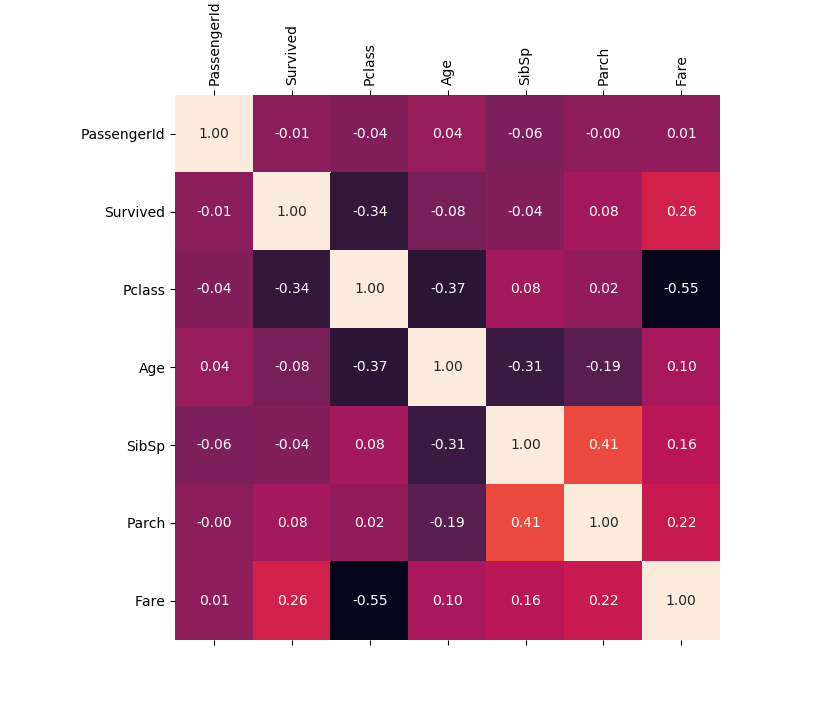

# Titanic_survivor_prediction

## A Machine Learning-based guide to predict the survival rate of the Titanic disaster

From the classic Titanic machine learning (ML) competition on [Kaggle](https://www.kaggle.com/c/titanic/overview) website. The very first steps to dive into ML competitions and familiarize with prediction systems.

The approach shown here makes use of classic ML techniques to create a model that predicts which passengers survived the Titanic shipwreck. [Python file](Titanic_eng.py). 

Basically, the process involves:

    * Feature engineering
      * Data analysis
      * Age prediction
      * Fares estimation
    * Data cleaning
    * Data normalization and scaling
    * Automatic classification

### Training data description.
Composed of 891 rows with individual information each that includes: PassengerID, Survived value, Pclass, Name, Sex, Age, SibSp, Parch, Ticket, Fare, Cabin and Embarked.

### Test data description
Composed of 418 rows with individual information each that includes: PassengerID, Pclass, Name, Sex, Age, SibSp, Parch, Ticket, Fare, Cabin and Embarked.

### Feature correlation map
The feature correlation map shows if there exists any statistical association between two variables. The closer value to 1 or -1, the higher the correlation. For instance, Survived feature is highly correlated to Pclass and Fares

### Classification results with sklearn library
Different classification methods were applied in the training set.

